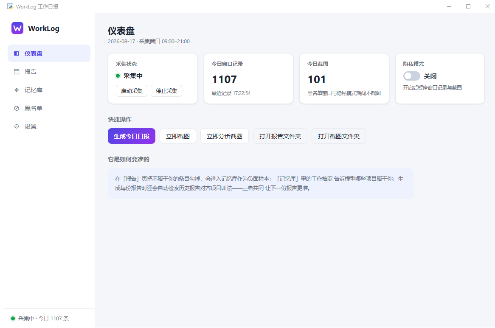
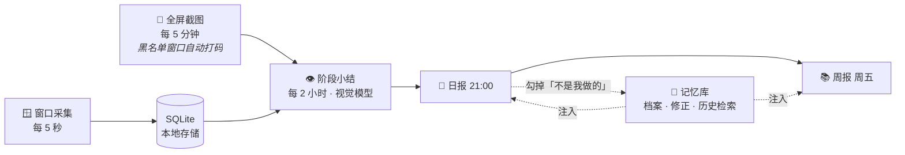

<div align="center">


# WorkLog

**AI 自动工作日报 / 周报 —— 记录 · 看懂 · 汇报，全自动**

[](https://github.com/wangyaominde/auto_report/actions/workflows/build.yml)


它安静地记录你一天用了什么、做了什么，定时截屏交给多模态大模型"看懂"，
每天 21:00 自动生成日报、每周五自动生成周报——而且**越用越准**。



</div>

---

## ✨ 特性一览

| | 功能 | 说明 |
|---|------|------|
| 🕐 | **自动采集** | 每 5 秒记录前台窗口（应用 + 标题 + 时长），本地 SQLite，零上传 |
| 👁️ | **截图视觉分析** | 每 5 分钟截屏、每 2 小时让视觉模型生成"阶段小结"——报告基于你实际做的事，不是靠应用名瞎猜 |
| 📝 | **自动出报** | 21:00 日报、周五周报、月报；关机漏报下次启动自动补齐（最近 7 天） |
| 🧠 | **记忆库** | 勾掉"不是我做的"条目 → 负面样本；工作档案定义归属；历史报告检索对齐叫法 |
| 🎯 | **真实性约束** | 查看 ≠ 完成、屏幕上出现 ≠ 你做的、会议投屏自动检测并按他人内容处理、不确定标「待确认」 |
| 🔒 | **隐私设计** | 黑名单窗口不记录 + 截图区域自动打码；一键隐私模式；可选"分析后即删截图" |
| 🤖 | **多模型** | 预设 MiniMax / OpenAI / Anthropic / Kimi / DeepSeek，任意兼容接口，秒级测试连接 |
| 🖥️ | **原生体验** | pywebview 原生窗口 + 系统托盘，关窗即缩托盘；引擎纯标准库可独立 CLI 运行 |

## 🔄 它是怎么工作的



三层准确性防线：**采集层**（黑名单 + 打码 + 隐私模式）→ **分析层**（会议检测 + 归属判别）→ **生成层**（记忆注入 + 真实性硬规则 + 低温度）。

## 🚀 快速开始

**方式一：下载安装包**（免 Python 环境）

从 [Releases](https://github.com/wangyaominde/auto_report/releases) 下载 `WorkLog-windows.zip` / `WorkLog-macos.zip`，解压即用。数据目录在 `~/WorkLog`，首次启动到「设置」页填 API Key 即可。

**方式二：源码运行**

```bash
git clone https://github.com/wangyaominde/auto_report.git && cd auto_report
pip install -r requirements.txt        # 仅 GUI 需要；引擎零依赖
cp .env.example .env                   # 填 Key，或启动后在 GUI「设置」页配置

# Windows
powershell -ExecutionPolicy Bypass -File .\start-gui.ps1
# macOS（需授予终端「辅助功能」与「屏幕录制」权限）
python3 worklog_gui.py
```

启动后 GUI 常驻托盘，内置调度器自动完成一切：采集守护、截图、分析、出报、补漏。
**托盘"退出" = 自动化全部停止**；平时关窗即可。

> 💡 开机自启：把 `start-gui.ps1` 快捷方式放进 `shell:startup`（Windows），或将 `worklog_gui.py` 加入 macOS 登录项。

## ⚙️ 配置

在 GUI「设置」页可视化配置，或直接编辑 `.env`：

| 变量 | 说明 | 默认 |
|------|------|------|
| `LLM_API_URL` | 接口地址（OpenAI / Anthropic 兼容） | MiniMax |
| `LLM_API_KEY` | API Key **（必填）** | — |
| `LLM_MODEL` | 模型名（截图分析需支持视觉） | `MiniMax-M3` |
| `LLM_API_FORMAT` | `anthropic` / `openai`，留空按 URL 自动判断 | 自动 |
| `LLM_MAX_TOKENS` | 单次生成上限 | `8000` |
| `LLM_TEMPERATURE` | 低温度减少模型自由发挥 | `0.2` |
| `LLM_MAX_IMAGES` | 每段视觉分析发送的截图数 | `8` |
| `SCREENSHOT_RETENTION_DAYS` | 截图本地保留天数 | `7` |
| `SCREENSHOT_DELETE_AFTER_ANALYSIS` | `1` = 分析后立即删除截图原图 | `0` |

## 🛠️ 引擎 CLI（零依赖，可脱离 GUI 使用）

```bash
python3 claude_auto_report_code_minimax.py                  # 前台采集，Ctrl+C 停止并出日报
python3 claude_auto_report_code_minimax.py --screenshot     # 截屏（黑名单窗口自动打码）
python3 claude_auto_report_code_minimax.py --analyze-phase  # 分析新增截图 → 阶段小结
python3 claude_auto_report_code_minimax.py --report [YYYY-MM-DD]         # 日报，默认今天
python3 claude_auto_report_code_minimax.py --weekly-report [YYYY-MM-DD]  # 所在周周报
python3 claude_auto_report_code_minimax.py --monthly-report [YYYY-MM]    # 月报
python3 claude_auto_report_code_minimax.py --test-llm       # 测试 LLM 连接（秒级）
```

## 📦 构建发布

推一个 tag 即自动构建双平台并发布 Release：

```bash
git tag v3.1.0 && git push origin v3.1.0
```

也可在 [Actions](https://github.com/wangyaominde/auto_report/actions/workflows/build.yml) 页手动触发（Run workflow），产物在 Artifacts。

## 📁 数据与隐私

| 数据 | 位置（源码运行 / 打包版） | 说明 |
|------|--------------------------|------|
| 活动记录 | `~/.worklog/activity.db` | 窗口标题与时长，仅本地 |
| 截图 | `screenshots/` / `~/WorkLog/screenshots/` | 默认 7 天清理，可设分析后即删 |
| 报告 / 小结 | `reports/` `analysis/` | Markdown，仅本地 |
| 记忆库 | `memory/` | 工作档案 + 修正记录，仅本地 |
| 密钥配置 | `.env` | 已被 `.gitignore` 排除 |

> ⚠️ 本工具会截取你的屏幕并发送给**你自己配置的** LLM 服务商用于生成工作摘要，请自行确认所用服务商的数据政策。除此之外，一切数据只存在你的本机。
